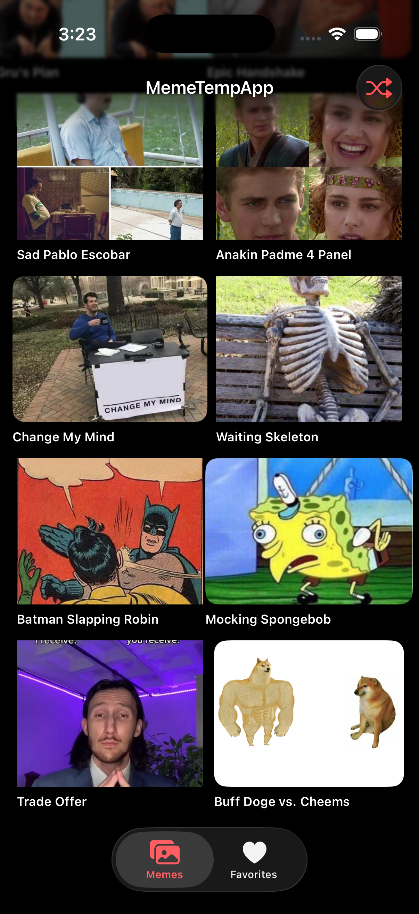

# MemeTempApp

A production-grade iOS meme browser built with SwiftUI and Clean Architecture, fetching templates from the [imgflip API](https://api.imgflip.com).



## Features

- Browse popular and trending meme templates
- Save favorites with local persistence
- Share memes via the iOS share sheet
- Open memes in Safari
- Shuffle to a random meme
- Pull-to-refresh
- Full error states: loading, empty, no internet, retry

## Architecture

Clean Architecture with Repository pattern, matching production standards.

```
Presentation   →   ViewModels (BaseViewModel + ViewState)
                       ↓
Domain         →   Repository Protocols
                       ↓
Data           →   APIClient (actor) + FavoritesRepositoryImpl (actor)
```

## Tech Stack

- **SwiftUI** — declarative UI, AsyncImage, TabView
- **Swift Concurrency** — async/await, actors, no completion handlers
- **Clean Architecture** — repository pattern, protocol injection
- **URLCache** — 20MB memory / 100MB disk image caching
- **UserDefaults** — favorites persistence via actor
- **XCTest** — unit tests for ViewModels and Repositories

